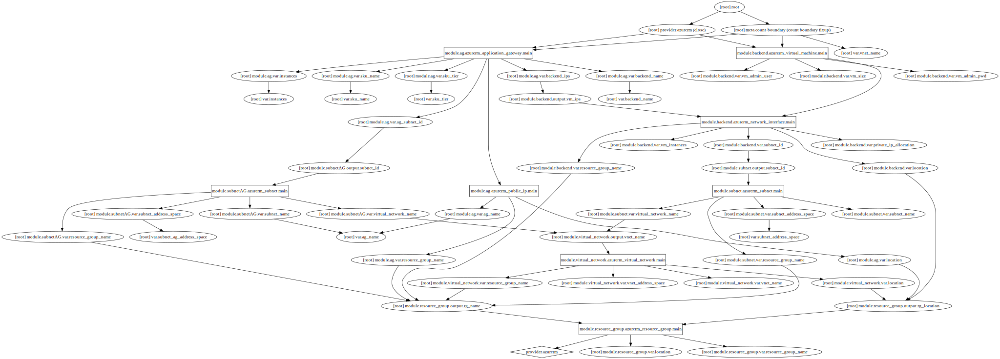

# Test the template

This template deploys as many VMs as needed + an application gateway pointing on a backend of all these VMs

You will deploy the following architecture

---

---

## Configuration

Configure the virtual machines as follows vm_name = ["hostname","private_ip"]

    "vm_instances" {
        man1 = ["prod-manager1","10.0.1.4"]
        man2 = ["prod-manager2","10.0.1.5"]
        man3 = ["prod-manager3","10.0.1.6"]
    }

## Run
    terraform init
    terraform apply

