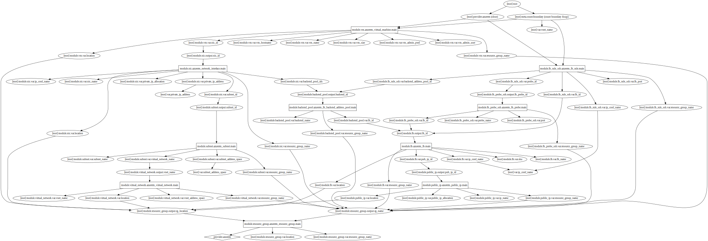

# Test the template

You will deploy the following architecture

---

---
## Run
    terraform init
    terraform apply

## Connect to the vm through the load balancer

Go to your azure portal and get the load balancer public ip

Then
    ssh testadmin@LB_PUBLIC_IP 
    (pwd : admin!1234)
